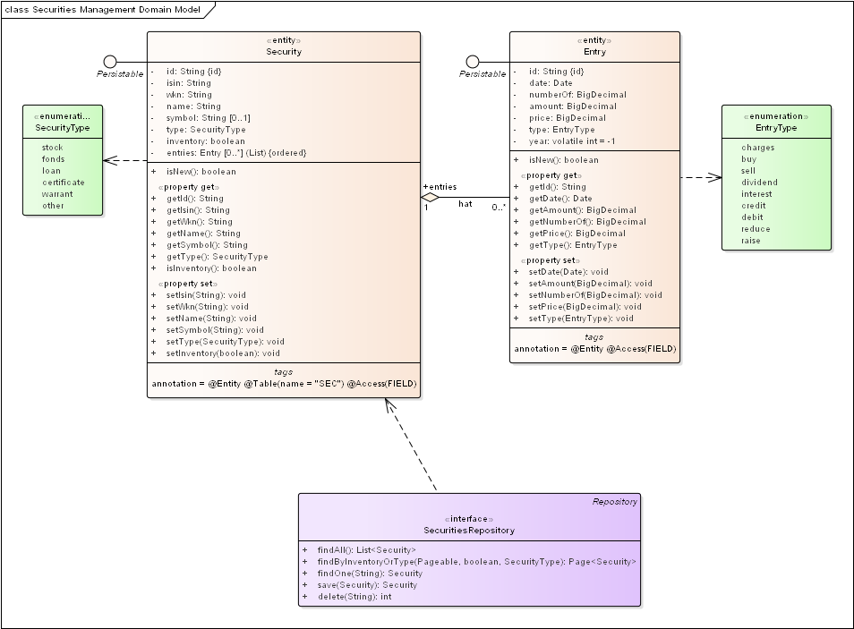

= Die Domänen der Wertpapierverwaltung
Frank Rahn <frank@frank-rahn.de>
:toc:
:toclevels: 3
:toc-title: Inhaltsverzeichnis
:sectanchors:

== Das Model der Wertpapierverwaltung

== Build mit Maven
Für die Konfiguration von Eclipse bitte das Eclipse-Plugin http://www.eclipse.org/m2e/[M2Eclipse] verwenden.

[source,bash]
.Wertpapierverwaltung bauen
----
$ mvn clean install
----

== Homepage des Autors
https://www.frank-rahn.de/?utm_source=github&utm_medium=readme&utm_campaign=microservices&utm_content=top[Frank W. Rahn]
