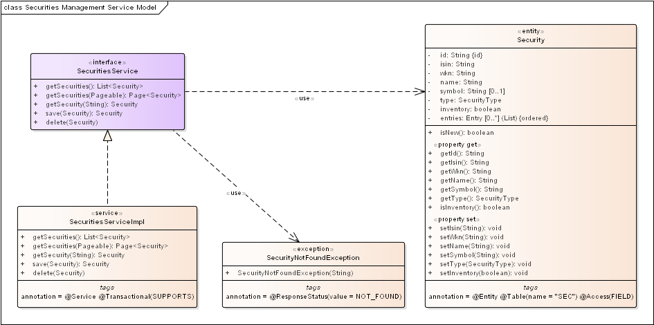

= Die Services der Wertpapierverwaltung
Doc Frank Rahn <frank@frank-rahn.de>
:toc:
:toclevels: 3
:toc-title: Inhaltsverzeichnis
:toc-placement!:
:sectanchors:

toc::[]

== Das Model der Wertpapierverwaltung

== Build mit Maven
[source,bash]
.Eclipse Konfiguration erzeugen
----
$ mvn eclipse:clean eclipse:eclipse
----

[source,bash]
.Wertpapierverwaltung bauen
----
$ mvn clean install
----

== Homepage des Autors
https://www.frank-rahn.de/?utm_source=github&utm_medium=readme&utm_campaign=microservices&utm_content=top[Frank W. Rahn]